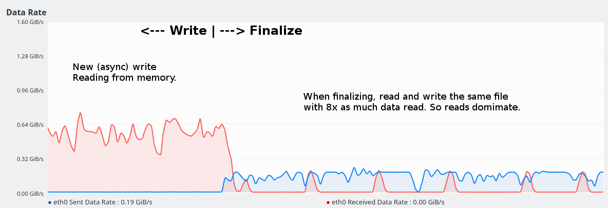
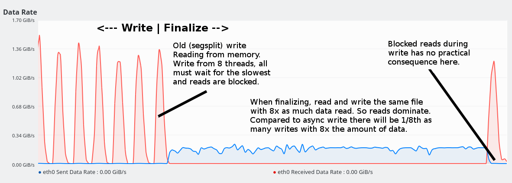
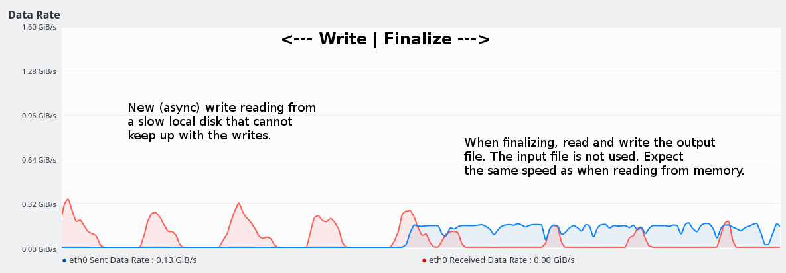
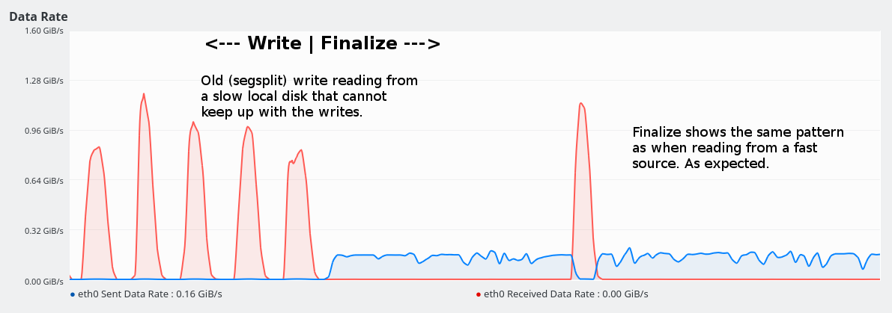
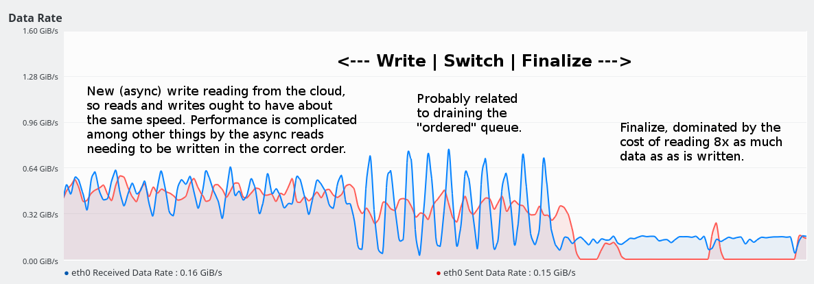
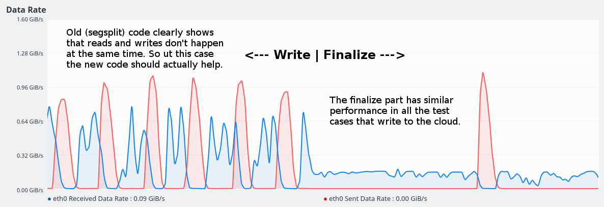

# Asynchronous write in the SDAPI interface

There is a new opt-in feature that writes data asynchronously to
seismic store. The code is implemented inside OpenZGY, just above the
layer that writes to SDAPI. So it affects all users of that library.
Technically it could instead be added as an opt-in feature of SDAPI
(between SDGenericDataset and its Impl class) where it might benefit
all applications that write to seismic store and not just OpenZGY.

Note that this is all about writes. Reading data remains synchronous.
However, much of the implementation might be re-used to also provide
an asynchronous readBlock. That would be more visible to application
code which would need some kind of waitUntilDataBecomesAvailable()
method. Or a callbackToInvokeWhenDataBecomesAvailable().

## Benefits

* Existing applications that write data to the cloud and do not do any
  form of multi-threading should see a major performance improvement.

* New applications can be cheaper to write since they don't need to
  add code to multi-thread writes to the cloud.

* Existing applications that already does some form of multi-threading
  might also see improvements. Your mileage may vary.

* The feature is almost but not quite transparent to the application
  that chooses to enable it.

* It is SDGenericDataset::writeBlock() that is now asynchronous and
  still "fire and forget". I.e. application can pretend the write was
  done immediately.

* The code still supports mixing reads and writes in the same open
  file. Additional locking happens behind the scenes to block threads
  that try to read data that is still being written out.

* The maximum number of writes in progress, i.e. the maximum thread
  count, is configurable.

* A new "discard" feature is available for applications that decide
  they don't want the output anyway. E.g. if the user clicks a "Stop"
  button in a copy operation. All pending reads will then unblock and
  throw an exceptions. All pending writes will unblock and silently do
  nothing. Background threads that have already started writing cannot
  be aborted. This is a limitation in SDAPI.

## Drawbacks

* The code will need additional work and testing to become production
  quality.

* When enabling the feature, any errors from writeBlock() will cause
  the exception to be thrown for the wrong data block. Typically the
  next write that is scheduled. Or when the file is closed. For all
  practical purposes this means that the file will be corrupt if at
  least one block has been successfully written and some other write
  fails. This is already the case for OpenZGY so the issue in that
  case is not applicable. Other applications might care.

* If the same file is opened one place for read and one place for
  write at the same time, or multiple times for write, the
  asynchronous write feature will cause data to become corrupted. Note
  that even without the asynchronous write this is pretty bad
  practice. For OpenZGY the issue is not applicable because this
  scenario would fail in any case. It just fails harder now.

* Most existing applications probably do some multi-threading already.
  If the benefit of switching on the new feature is small or even
  non-existent then switching might not be worth the trouble. And
  worth the extra testing.

* The limit on background threads is per file. It is the application's
  responsibility to choose this limit wisely.

* For OpenZGY the performance boost up from the existing "segsplit"
  has been somewhat underwhelming. Typically 10-20% faster. There
  might still be scenarios where it helps more. In theory the new code
  might be slower if the application does unaligned writes and has a
  particular (not too small, not to large) size. I doubt that will
  ever happen in practice.

## Why the performance only improved by 10-20% on a Google VM.

This analysis is for the zgy copy application. It is somewhat valid
for other applications writing to ZGY but it depends on how those
applications use threads.

The timing results were somewhat underwhelming. I measured 10-20%
improvement for async write but your mileage may definitely vary.

Logging the network traffic should, and did, show a pronounced
sawtooth pattern on writes because after the old code started writing
from 8 threads all the threads needed to wait for the slowest one. And
during the writes the read treads were blocked so the network should,
and did, see reads dropping to zero while writes where in progress.

But. Sustained network throughput according to the log is around 0.7
GiB/s while peak throughput 1.4 GiB/s. Which means that the sawtooth
pattern doesn't affect the average throughput much. I cannot know for
sure why this happens but I am guessing that the Google VM this test
was run on is explicitly throttling the sustained I/O bandwidth but
not (or at least not as much) the peak bandwidth.

As for writes blocking the application: This would not affect the
speed much when the cost of writes is large compared to the cost of
generating the data. Because there isn't much to block. Similarly it
won't affect the overall speed that much if the cost of writes is
relatively small because the blocking caused by the writing are short.
It would only be noticeable when reads and writes happen to be
balanced.

### Conclusions

For ZGY I recommend enabling the code because there are probably some
cases where it really does help. Such as in a VM that has other rules
for throttling the bandwidth. The question is just how much more
testing is needed.

For SDAPI this is probably too high risk. The feature would be
convenient because it might for some applications remove the need to
implement multi-threading. But most production quality applications
probably need to be multi-threaded anyway.

### Figures from the bandwidth logging

## Implementation notes

Note that while a SDGenericDataset is supposed to be thread safe, it
is unspecified what happens if multiple writes or both read and write
is done concurrently from separate threads. Or if one thread issues a
close while other threads continue working on the file.

The code here doesn't try to change those rules. It only protects
against race conditions that arise because of the background writes.
So for a given block there can be at most one background thread
writing it and either one write or multiple reads, but not both,
waiting for that block. This implies that the per-block locking
mechanism doesn't need to worry about fairness. Fairness when blocked
due to too many background threads might be an issue though.

There are three components.

### Locking component

*  Read- and write locks on individual blocks.
*  Global i.e. entire file read- and write locks.
*  Lock for throttling the number of running background threads.
*  The discard feature (TODO, expose in OpenZGY somehow)

### ISDGenericDataset

* exposes an interface instead of a concrete class.
* If the code is to be moved to SDAPI it should go between
  SDGenericDataset and its Impl class so the user visible API doesn't
  change.

### Asynchronous component

* Implements ISDGenericDataset, and eventually forwards requests to
  some other ISDGenericDataset

* Set locks wherever needed. Including the lock to throttle writes.

* Create a new thread and allocate a new buffer for each writeBlock(),
  then start the write in the background. If this proves to be too
  much overhead then a thread pool and a buffer pool might be
  implemented.

* If the application tries to read back a block that is still being
  written then technically the data could be read from the buffer
  owned by the background buffer, And if the data exists in a buffer
  pool and has not been reused it might be read from there. Neither
  feature has been implemented because I suspect that most
  applications won't care.

## Compare with "segsplit" in OpenZGY

When segsplit is enabled, OpenZGY will collect [numthreads] blocks
worth of data and then write all those blocks in parallel using an
OpenMP loop. While the write is executing the application is blocked.
Even if the application handles threading itself, writing from a
background thread, all further writes to the OpenZGY file will block
until the data has been flushed. This is why the new asynchronous
write ought to be better. Writes start as soon as the first block is
ready, and other processing can continue.

The high level write() in OpenZGY collects one SDAPI block's worth of
data before writing it to the data store. OpenZGY allows misaligned
writes and for those it needs to do a read/modify/write cycle. The
existing implementation is smart enough to read the data from the
memory buffer if it is still there. This is why segsplit can
occasionally be faster than the new scheme. With the new scheme the
data becomes inaccessible as soon as it enters the background writing
thread. [Note, it *is* feasible to fix this]. While using the
"segsplit" method the filled buffers waiting to be written out can
still be accessed. So there is a greater chance of finding the data in
cache. I doubt this will be a common scenario, and it is fixable.

## When to use threading

The recommendaton for when to enable threading in OpenZGY are the same
for segsplit and the new writethreads. Only one of those two can be set,
and the impact in the system (allocated threads, extra memory used, etc.)
is similar.

|  Multi-threaded application? | ZgyReader | ZgyWriter |
| ------------------------------------ | --- | --- |
| Single threaded                      | Yes | Yes |
| MT on few or just one file at a time | No  | Yes |
| MT on many threads concurrently      | No  | No  |

The reason that ZgyWriter should normally turn on all three MT options
is that calls to write() are serialzed even if the application tries
to multi-thread those. And a ZgyWriter being read from is probably in
the finalize process which is mostly single-threaded.
