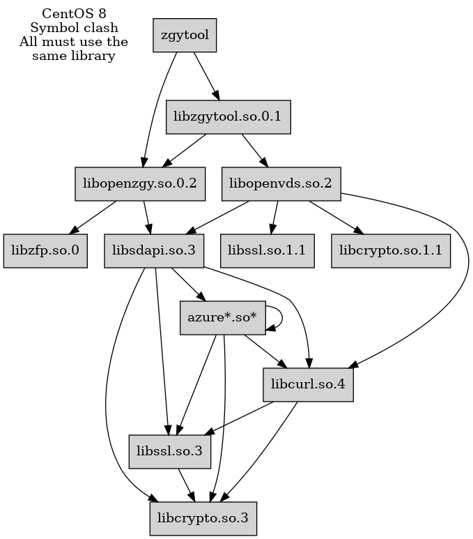
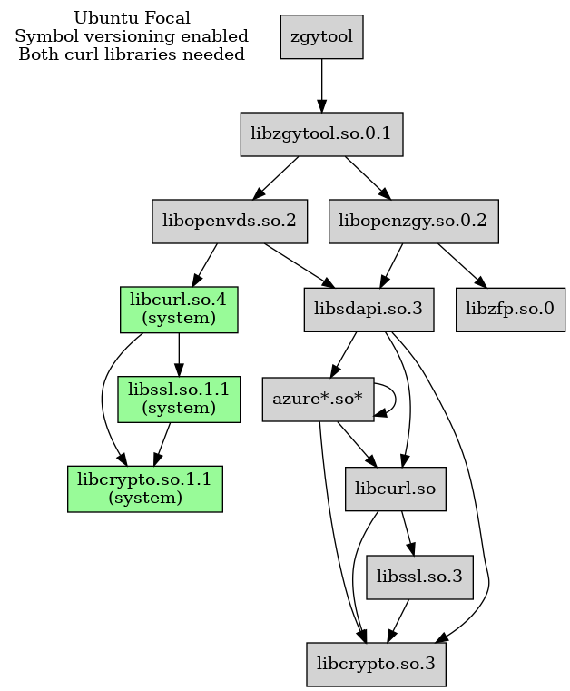

**This explanation only applies if we choose to switch back to dynamically linked locally built third party libraries on Linux.**

**TL;DR Patch both libcurl and libsdapi to make the SONAME consistent.**

This document has two main parts: Problems seen from the OpenZGY and
ZgyTool point of view and then a more general part with suggested
fixes. In particular, see the [fixes summary](#summary).

[[_TOC_]]

Sorry for the size of this document. If I had more time, I would have made it shorter.

# Version handling of dependencies

Version conflicts between dependent third party libraries is difficult. Especially for Linux where we may need to support 6+ distros, and where the shared objects are not as self contained as they are on Windows.

If a project builds everything from source it gets somewhat easier. Ditto for supporting just one distro. But "easier" does not mean "easy". You might try to build:
* the application
* openzgy
* sdapi
* azure storage
* curl
* other curl dependencies
* other azure storage dependencies

This only works if the deliverable is an application and not a library where we don't know who the consumers might be.

It may also fail if the project builds locally a package that is, or becomes, older than a system library with the same name. It isn't possible to rebuild the entire Linux distro. So, is likely that the main executable has a reference to some system library that expects the latest version of the package that was forced.

## Application example

ZgyTool can convert between ZGY and VDS file formats, both of which can access files on the cloud. ZgyTool links with libopenzgy.so and libopenvds.so. Both of those link with libsdapi.so. Both sdapi and openvds link with libcurl.so. Curl links with libssl and libcrypto. When all of these insist on using their own version, bad things happen.

In theory it is possible to have multiple versions of a library in the same application. This requires that the versions have different names as recorded in SONAME. Even if this holds true then duplicated libraries might somehow interfere with each other. Rules for symbol lookup in a Linux .so is quite different from those in a Windows .dll.

The situation gets worse when OpenVDS is involved because building OpenVDS will internally build some of its own dependencies from source. Even the SDAPI library. We don't control which versions are consumed there.

## Linux example

We have ssl version 1.1.1.k, 1.1.1.m, and 3.something. The first two have the same SONAME (ssl.so.1.1) and are obviously forward compatible. But they aren't backwards compatible because "m" defines some new symbols that are used in some other dependent library. Or maybe it isn't the "m" but rather some compiler flags used when building the library. So in this particular case we need to force the newer "m" to be loaded. Because when the SONAME is the same, we can only have one. Which is newest? The system provided one, or the one built from sources by package A? Or the one built by B? And does the solution to this problem apply to all the Linux distros? And have I even understood the ssl problem correctly? I see the "undefined symbol" but the root cause might be even more obscure.

See this [dependency chart](images/dll-hell-fig1.png) I made a while back. I think it depicts fairly well the situation I had then. One bogus dependency (dotted line) was added to help things along. That particular fix no longer works.

Somewhat unrelated but still a version issue:

We have libsdapi.so.3 (targeted for OSDU users) and libsdapi.so.3 (targeted for internal users) that are not binary compatible. Not only do those have the same SONAME; they have the same file name as well.

This is a particular problem for ZgyTool. The tool is used both by internal users and by osdu consumers. Because of the sdapi issue, we need to build two ZgyTool flavor as well. Instead of just swapping the libraries. The frustrating thing here is that the fix in SDAPI is trivial.

## Managing dependencies

This is a choice between pest, cholera, and covid.

### System provided binary packages.

On Linux this is supposed to be simple. Just find out what third party packages are needed and use dnf/yum/apt/whatever to install them. Only build from sources those higher level libraries that are not available in repositories: azure storage, sdapi, openzgy, openvds.
* \+ Simple maintenance.
* \- Almost no control over which versions are used.
* \- The libraries we do build from source might require other versions.

### vcpkg

Works on both Linux and Windows. Only a single choice needs to be made: the version of vcpkg to build from. Choosing "latest" generally gives you the latest and greatest of everything, already QC'd for conflicts. The main problem is that every library we build is expected to use vcpkg. And preferably applications as well. This is not realistic. And since vcpkg usually delivers very new versions, the risk of non-vcpkg code causing trouble is higher.
* \+ Fairly simple maintenance, even for multiple Linux and Windows versions.
* \+ Latest and greatest versions.
* \- Little control over individual versions.
* \- Issues if building some code outside vcpkg.

Somewhat unrelated: In the Dockerfiles the vcpkg version / git hash should always be specified explicitly even if we are ok with pulling "latest". This means that there won't be any automatic updates. If we tried asking for "latest", docker's cache won't be able to detect when vcpkg:latest had changed so a full rebuild is needed. The new version will be fetched eventually, when some other component has changed. That makes the upgrade non-deterministic and often dependant on which build server the build was assigned to. This would make it *really* difficult to debug problems.

### Manual

We can write scripts that downloads and builds every single required package by hand. Hard coding the desired version for each. The scripts for Linux and Windows will be quite different. The scripts for different Linux distros are expected to be similar but not identical. Due to the maintenance cost, we might end up using rather old versions. Upgrading only when forced to do so. And when that happens we might find that upgrading only the one package we know about won't work. Be prepared for chasing ripple effects.
* \+ Full control over versions.
* \- Very high maintenance cost, especially when supporting many distros.

In the manual mode, some libraries might be built without a specific version. Pulling the latest source code from somewhere on the net and hope it is compatible.
* \- No control over versions
* \- Still high maintenance cost, scripts for different distros may differ.
* \- Random build failures even when there were no local changes.
* \- Chasing version dependencies don by us, not by vcpkg team.
* \- No obvious benefits compared to the alternatives.

## Static vs. dynamic linking

This choice applies regardless of versioning method. It can be different for each library. Maybe. Some libraries might have a limitation that its dependencies have the same linkage type as itself.

The static / dynamic choice might affect which issues do and don't show up.

For the system libraries, dynamic is the rule. vcpkg appears to prefer static but the default can be changed. In the manual mode we can mostly choose on a library by library case.

## Current status

On Windows, the SDAPI dependencies is built using vcpkg. On Linux the official build of SDAPI uses the manual approach. Building from the OpenZGY baseline uses vcpkg both places because the manual method for 6+ distros would be very expensive. I don't remember what OpenVDS does today. I suspect sdapi has "manual latest" when OpenVDS is building it.

Most of our builds try to use dynamic linkage by default because static might conflict with the GPL or LGPL license. In manual mode we have full control also here. With vcpkg I have gotten most but not all libraries to become dynamic. In theory one can turn on "build both static and dynamic" in vcpkg but I could not get that to work. I had some more success patching the "triplets" to make the static build target actually build dynamic libraries.

Technically it might be possible to link OpenZGY with its vcpkg-built libsdapi.so.3 and at runtime pick up a different file. As long as sdapi itself (not necessarily its dependents) is kept dynamic. This is still the stuff of nightmares. Switching the library could easily fix some version issues but cause others.

An application linked with internal sdapi cannot have its library replaced at runtime with osdu-sdapi. See rant earlier in this document. The other way happens to work but it depends on undocumented behavior of the compiler. And is pointless anyway, because the swap won't enable the SAuth login. Which is the only difference. This can be fixed easily.

# How to fix it

## Summary

Best practices when we build a third party library from sources,
when the same library might be installed as a system package.

* Don't build from source if you don't need to.

* If the custom package is not backwards compatible with the system
  one then it should be linked statically. And try not to export any
  symbols from it.

* Exception: if the two packages do not have any exported symbols in
  common, and if the SONAME also differs, then the two packages might
  be able to co-exist in the same execuable. This might be the case if
  one of the packges uses versioned symbols and the other one doesn't.

* Otherwise, the SONAME of the custom built package should match the
  system package. Patch it if the build rules cannot change. See the
  system "patchelf" or the local "sofixup" script which does more.

* Folders with custom packages must come before system folders in the
  library search path. If a user no longer wants to use the custom
  package, e.g. because the system one is now newer, then remove or
  rename the custom package.

## Explain it to developers of this library

The main drawback with static link is that the library cannot then be
upgraded by the end user without rebuilding the code that linked it
statically. This task ranges from inconvenient (convoluted build) to
impossible (due to closed source). In the latter case a static link
might also violate licensing terms.

The problem with dynamic link is that we must force loading the newer
library instead of (if SONAME matches) or earlier than (if mismatch).
Typically the private build will be newer. So this is the one that
gets forced. But what happens if the machine is set up to download
updates unattended? At some point the library in /lib64 might become
the newer one. And our application might break without warning.

Major caveat: Getting the search order wrong might cause subtle bugs
instead of failing outright. Especially if the SONAME doesn't match.
The code that actually gets called might be a mix of the old and new
version. Or if you are lucky it might work without a hitch. Relying on
luck has never been a good idea, though.

A typical failure when SONAME does match is that an unrelated part of
the system might make a call to a system library that in turn has a
dependency to the library we forced. And that library might expect a
newer version than what we chose to use.

If we really cannot link the incompatible version statically, try the
following. This is for the system library vs. custom library case. The
case with two or more custom libraries might be trickier.

* Make sure all newer versions (usually the custom builds) are
  backwards compatible with the old ones. Among other things, this
  means that all symbols in the old version also exists in the new.
  Dynamically loading two incompatible versions probably cannot be
  made to work reliably. Choosing a static link might be the only
  option.

* Always ensure that RUNPATH includes $ORIGIN so custom versions are
  preferred by default. The preferred version can change at runtime,
  but only if RUNPATH is correct.

* If building a custom package from sources that has a different
  SONAME than the system one, consider patching it to match the system
  version. If the package builds multiple shared objects you might also
  need to patch NEEDS in the other packages.

* If the SONAME needs to be different for a particular library (not
  best practice) then ensure the custom version comes earlier in the
  link command line, directly or indirectly. This is different from
  the path for runtime lookups. E.g. add an explicit library reference
  to the main application. This might be tricky if the main
  application is outside our control. Note that both libraries will be
  loaded, but all symbol lookups should resolve to the custom library
  as long as it is the newer one. Do this step even if you suspect
  that the custom version might be too old. because, that can be fixed
  at runtime (see below) while the fix here is done at link time.

* The following step might need to be done by the end user. If or when
  the system version becomes the newest one. Remove the custom built
  library from the application BIN_DIR and all links to it. if SONAME
  differs, also create a symbolic link in BIN_DIR/SONAME pointing to
  the newer system library. Both libraries might be loaded if the
  runtime linker doesn't follow symlinks and realize that the files
  are identical. But all symbol lookups should resolve to the custom
  library.

* Caveats when SONAME differs, either because it cannot be patched or
  because the libraries are incompatible. Both libraries will get
  loaded and their symbols might interfere with each other. Especially
  if the libraries are incompatible. Calls from the application might
  end up invoking code from both libraries. Causing some really
  obscure bugs. Which might only happen at customer sites.

## Explain it in release notes for this library

This software contains a custom built version of several packages that
might already be installed on the system. [Insert list here]. If a
system library is upgraded to a version that is newer than the custom
one, and the new version is backwards compatible, then the custom
library should be removed along with its version links. E.g. delete or
move libFOO.so* not just libFOO.so from the application directory.
This is a manual step.

Note that upgrading a system library might happen automatically. If
your application suddenly starts throwing "symbol not found" errors
then this might indicate that something has been upgraded.

Figuring out which library is the newer one might be tricky.

[Add if the SONAME might differ for compatible packages]

For the libraries [inset list here] the removal might cause a "library
not found" error. Don't panic. Use "ldd" to find the NAME (without
path) that the application is looking for. Then create a symbolic link
"NAME" in the application folder pointing to the full path of the
system library. But beware: If this appears to be needed then the new
version might not be backward compatible. In which case you should
leave it alone and cross your fingers.

## Why exported symbols get mixed up

See the linked figures if you are really interested.

* The [incompatible](images/dll-hell-fig2.png) case
* Compatible but [SONAME differs](images/dll-hell-fig3.png)
* With [patched SONAME](images/dll-hell-fig4.png)

# Debian/Ubuntu vs RedHat/CentOS

Are you confused yet?

On Debian based distros, the system libcurl is built with versioned symbols
while the one that vcpkg builds is not. So for those builds the system and
local curl are incompatible and have no symbols in common. The SONAME
should differ in this case. It already does, so no patching required.
Both libraries will get loaded.

On RedHat based distros the symbol names will clash. The references need
to be patched. Most likely the vcpkg version will be newer, so the locally
built versions should not be removed.

The next two figures show the relevant dependencies as of 17/aug/2022.

# Build tools

## scripts/sofixup

    #!/bin/bash
    #
    # Fix shared object references to libraries known to be compatible
    # but where the SONAME differs and we wish it didn't.
    #
    # Usage: sofixup [-l] old new file ...
    # Example:
    #   sofixup 'libsdapi.so.3.* 'libsdapi.so.3' BIN_DIR/*.so*
    #
    # All definitions and references matching "old" will be changed to
    # define (SONAME) and reference (NEED) "new". If "-l" is provided
    # symlinks are adjusted as well, for SONAME matches.
    #
    #
    # The script ignores symlinks passed on the command line.
    #
    # Caveat when -l is used. The script expects that there will be
    # just a single non-symlink file that defines (with SONAME) the
    # library. This may not be the case if symlinks have been turned
    # into copies by unzip. Or worse, two different versions might
    # exist in the same folder. The result is unspecified. Passing a
    # sorted list of files to a single invocation of the script might
    # help. At least it makes the problem somewhat more reproducible.
    #
    # -l causes existing symlinks are removed and replaced with these:
    #    libname.so -> libname.$new
    #    libname.$new -> $file
    #
    # Obviously the link is not created if source and target are equal.
