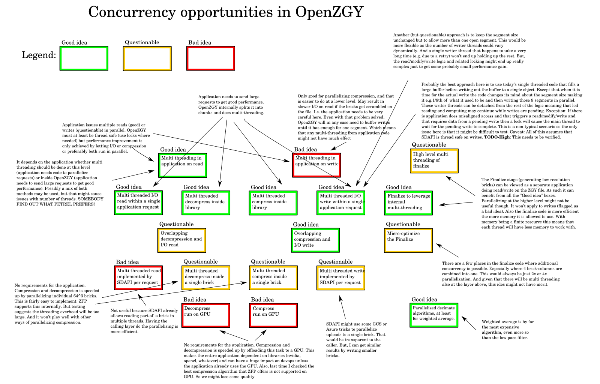
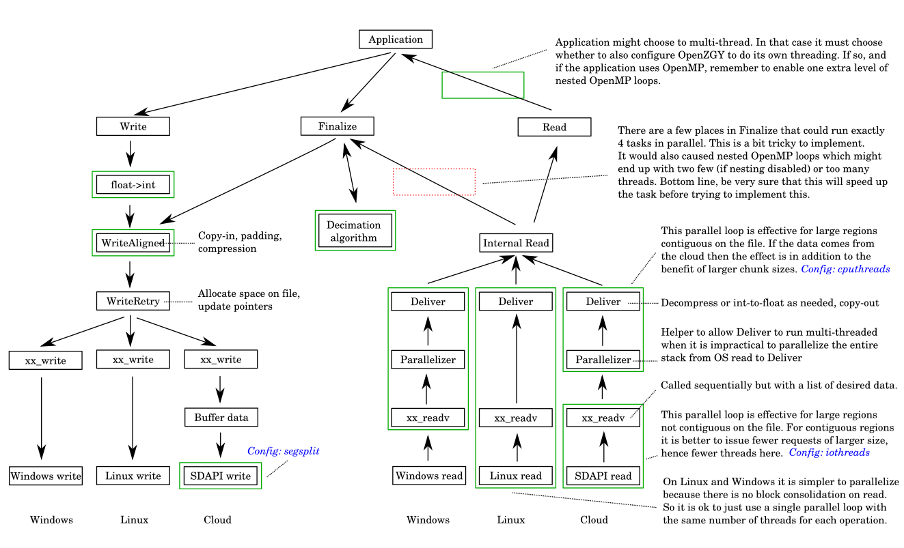

# Multi-threading in OpenZGY/C++

## Intended audience

Developers working on the OpenZGY code.
To a lesser degree, also developers using the OpenZGY API
that need to understand how to improve performance.

## Thread safety from the application's point of view for OpenZGY/C++

### Minimum guarantee of thread safety

Setting up global factories for compression, I/O backends, etc.
and using them is synchronized using locks. This might be
overkill because it is expected that the setup will be finished
by the time any real OpenZGY operations. But it makes for a
friendlier API.

Any operation that target different open file handles may be
invoked concurrently.

Multiple read operations may be invoked concurrently even on the
same open file handle as long as no operations other than read
can be pending. There is no guarantee that the reads will
actually execute concurrently. The implementation is allowed to
serialize operations using locks.

All calls to IZgyWriter that can potentially cause a data race
are serialized using a lock.

### Validating the ZGY source code

Most of the classes have been annotated with how they are
intended to work with respect to concurrent access.
Many of them have one of the following statements:

* Enums do not have race conditions.
* Interfaces do not have race conditions.
* Thread safety handled internally in the class by locking.
* Modification may lead to a data race. This should not be an issue,
  because instances are only meant to be modified when created or
  copied or assigned prior to being made available to others.
* Modifications may lead to a data race. Read operations in the API
  should not cause instances of this class to change. This means
  that as long as the application follows the rule that only read
  operations will have concurrent access then the code should be safe.
* Modification may lead to a data race. This should not be an
  issue, because instances are expected to be short lived.
  Such as emporaries that exist only inside a function. The
  code that uses the instances will be in full control and
  should make sure there are no data races.

### Visual brain dump

The following figure tries to explain the situation more like
one might do on a whiteboard. It may of may not be easier to
comprehend.



### Current implementation

Bulk read can be parallelized at the application level.
Additionally, all the "good idea" boxes in the diagram
have been implemented inside OpenZGY except overlapping
I/O with I/O write. Which isn't useful if the application
does any kind of multi-threading. When reading an on-prem
file on a Windows machine the actual read from the OS is
single threaded. Again, this probably doesn't have much
practical effect.

Bulk write is by design not thread safe and most operations on
ZgyWriter will be serialized using locks. Any concurrency on
writes need to be handled at lower levels inside OpenZGY.

The next figure is more oriented towards what is currently implemented
and where.

The diagram is an attempt to visualize how data flows inside the
OpenZGY accessor and at which points parallel processing occurs.
It is not intended to be very accurate, and since it tries to
show data movement it doesn't match the call hierarchy. Each green
border represents the effect of one OpenMP loop. Currently three
of these allow configuring the thread count.



#### Reading

If the application is going to request small (1 brick) regions
at a time then the application itself can and should issue reads
from multiple threads. None of the parallel loops inside OpenZGY
will help if the reads are all for a single brick.

Applications will see much better performance on the cloud if
they are able to issue larger requests that can end up reading
consecutive blocks. Applications should let OpenZGY break down
the request into bricks instead of doing that itself. With the
application issuing fewer and larger requests thus means that
OpenZGY must be able to do multi-threading of decompression etc.
and of the SDAPI requests in those cases where the data was not
contiguous. If the application can issue arbitrarily large
requests limited only by available memory then this means it is
better to issue single threaded requests from this level.

A real world application might benefit from having both the
application itself and the OpenZGY library use parallel loops.
Using OpenMP this creates challenges with handling nested loops.
Turn off support for nested loops and you disable most
multi-threading inside OpenZGY. The configured loop count is
simply ignored. Turn it on and you risk creating too many threads.
This is why OpenZGY provides fairly fine grained control over how
many threads to use. Expect to do some tweaking.

The ideal solution for managing the thread count is to implement
a global pool of worker threads inside OpenZGY. Which in turn
implies handling queuing and ensuring a reasonably fair
scheduling. Implementing that feature has not been scheduled.
There are packages to do this, but: As far as I know the application
and OpenZGY will then need to use the same package for this to work.
And that simply isn't feasible.

Some applications do multithreading at higher levels of the code
and might have problems *not* accessing OpenZGY from
multiple threads.

The multi-threading inside OpenZGY allows the application to not
bother with multiple threads at all. This feature is actually
quite important, because the finalize step after writing a file
needs to read back the data before it can create low resolution
bricks. Finalize is difficult to parallelize but it can issue
almost arbitrarily large bricks. As explained earlier, single
threaded access in that case is a good thing.

#### Writing

This is much simpler with respect to multi-threading. The
application is not allowed to multi-thread and the library
generally does as much as it can in this respect. Some
configuration of buffer size etc. can indirectly affect
threading.

### OpenMP caveats

Note for applications that configure OpenZGY to use multi-threading

If the application reads or writes data from inside an OpenMP loop,
even if there is just one active thread (as required for write),
and the application tries to configure OpenZGY to use additional
multi-threading, then OpenMP must be configured to allow at least
one extra level of nested loops. Otherwise OpenMP insde OpenZGY
will be disabled.

How to enable nested loops depends on the OpenMP version.
Here is what I *think* the rules are:

- OpenMP 5.x, which is not widely adopted and I haven't tested.
  - omp_set_max_active_levels(nesting);
- OpenMP 3.x and 4.x. Currently used in most Linux distros.
  - omp_set_nested(true);
  - omp_set_max_active_levels(nesting);
- OpenMP 2.x or older. Currently used in Windows.
  - omp_set_nested(true); // In this case it is just an on/off switch.

This line will show the current OpenMP version on Linux:

```g++ -fopenmp -dM -E -x c++ - < /dev/null | grep _OPENMP```

| Task | Function | Remarks | Option |
|------|----------|---------|--------|
|Reading from local file on Linux<br/>```LocalFileLinux::xx_readv```|Parallel read, copy out, and decompress|Not configurable. parallel_ok not used.|Consider disabling for uncompressed read.
|Reading from local file on Windows<br/>```FileParallelizer::xx_readv```|Parallel copy out and decompress.|Not configurable. parallel_ok not used.|Consider disabling for uncompressed read.|
|Reading from SDMS<br/>```SeismicStoreFile::xx_readv```|Parallel read.|Configure with iothreads.||
|Reading from SDMS<br/>```FileParallelizer::xx_readv```|Parallel copy out and decompress.|Configure with cputhreads.|Consider disabling for uncompressed read.|
|Writing<br/>```ZgyInternalBulk:: _writeAlignedRegion```|Copy in and compress.||Might disable if uncompressed.|
|Writing<br/>```SeismicStoreFile:: do_write_many```|SDMS only, parallel write.|Configure with segsplit.|Almost certainly useful. Leave on.|
|Writing<br/>```DataBufferNd<T,NDim>:: s_scaleFromFloat```|Writing float data to int file.|Might be N/A for Petrel realize. Also, sse2 candicate.|Will disable, because potential benefit is small anyway. And potential downside is bad.|
|LOD compute<br/>```lodalgo.cpp:createLodMT```|Parallel LOD computation (CPU only).||Short term, disable completely. Later might add proper configuration, but Petrel will probably keep it disabled. Long term, use thread pool instead of OpenMP|
|Compute range<br/>```DataBufferNd<T,NDim>:: range```|Min/max of vector|MT Disabled. Also, now uses sse2.|
|ZgyTool<br/>```zgy2zgy.cpp: zgy2zgy_copyloop```|Parallel high level copy, excluding finalize.|Configure with --threads. Caveat: --threads > 1 will enable OpemMP nesting globally. Not a good idea when run inside Petrel.|Leave this off when called in-process.|

### Why is it so hard?

Technical explanation of multi-threading issues in general.

Deciding on a good number of threads is inherently hard. The value to
use will often end up being set by somebody's **gut feeling**. A very
long term solution might be to look into PPL, TBB, or other
technologies instead of OpenMP or home grown thread pools. In
particular, OpenMP has problems with nested parallel loops.

Using gut feeling is **often good enough**. At least in the sense that
turning on MP provides some speedup over single threaded. Even if
small. The problem is that incorrect configuration might cause the
code to run **very much slower** than the single thread case.

The optimal thread count might depend on:

- Complexity of algorithm, too simple means bad overhead to work ratio.
- Hardware (number of cores) because this changes the default thread count.
- OS, because OpenMP differs. The Windows one is very old.
- Global setup, because the OpenMP "nested" flag is global.
- OpenMP implementation, will a huge number of nested threads slow down?
- When nested loops are enabled, depends on what the outer loop is doing.
- When nested loops are disabled, some loops might never be parallelized.

In Petrel, creating a new thread is an order of magnitude more
expensive than the cost in a smaller application. Possibly because of
the ~70 places that subscribe to notifications on thread create.
Additionally, OpenMP often doesn't seem to use a thread pool. And
worse, it will often create a thread for each CPU even when a
num_threads clause says that fewer are needed.
