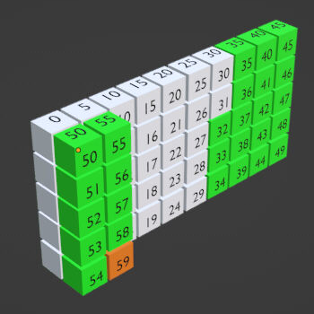

# This describes a major rewrite of the OpenZGY bulk layer.
## The goal is to speed up writes.

Low resolution bricks will now be written interleaved with full
resolution data instead of written in a separate pass. The pull
request includes other performance improvements as well.

This is a performance vs. data fidelity issue. Reduced fidelity **only
applies to low resolution data**. The original OpenZGY design favored
data fidelity and assumed that performance on writes (which happen a lot
less than reads) would not be important. Users apparently thought otherwise.

After the change, low resolution data might show some barely visible
brick-boundary artifacts. Like the old, closed-source ZGY library did.
In compressed files there might be more compression noise in level 2
and above. The emphasis here is on *might*. Typically it shouldn't be
noticeable.

None of these effects are considered regressions, as they simply make
OpenZGY behave more similar to the old library. Or they refer to
features that are new in OpenZGY.

Effects on application code include:

- If the application wants to fine tune the decimation algorithm
  and/or when low resolution is generated, this is now done when
  opening the file instead of in the call to finalize() or close().

- If float data is written and the application already knows the
  value range of the data, the range can be specified on open.
  Failure to do so will give a less pleasing histogram with some
  empty bins at the end.

- The application is no longer allowed to delete existing low
  resolution data. If a file is reopened and written to with
  LodMode::Never, and the file already contains low resolution data,
  then the low resolution bricks end up stale.

- A separate progress bar for finalize will no longer be needed to
  avoid having a realize in Petrel seem to hang at 99% done. The
  application will only hang for a short while processing the last
  few low resolution bricks. Unless the application explicitly asks
  for LodMode::Rebuild. That brings back the previous OpenZGY
  behaviour of needing a progress bar. Some applications, such as
  Petrel, don't provide one.

Several minor annoyances in the deprecated ZGY-Public will come back.

- Low resolution data might show some barely visible brick-boundary
  artifacts. Like the old, closed-source ZGY library did.
  
- Wrong statistics with too wide min/max might be seen if:
  - The same samples written more than once.
  - The value zero sometimes included in the min/max range even if not in input.

- Wrong histogram with missing values might be seen if:
  - The same samples written more than once.
  - Write to file opened for update, even if samples only written once.
  - Open for update will not be able to change the histogram range.

- Wrong histogram with negative bin counts which may be caused by:
  - Numerical instability.
  - Read/modify/write on compressed data (might not have worked anyway).

- Inefficient histogram not using the entire available range caused by:
  - Chicken and egg problem if application cannot provide value range.
  - The heuristic usually gives acceptable results but rarely perfect. The result should still better that the old ZGY-Public, though. 
  - In some rare cases the heuristic might fail completely.

- Low resolution bricks will be lower quality
  - Brick artifacts in lod1 bricks.
  - Brick artifacts in lod2 and above bricks (for different reasons).
  - The first few lod1 bricks may show severe brick artifacts.
  - The first few lod1 brick contents are not reproducible due to data races.

- In compressed files there might be more compression noise in level 2
  and above. Lowering the quality further. The is N/A for ZGY-Public,
  which did not compress.

- Reading these files from sdms may theoretically be slower because:
  - Low resolution bricks will be interleaved with lod0.
  - Mitigated somewhat by writing brick-columns.

- Inaccurate or lower quality statistics which may be caused by:
  - Collecting statistics before any compression.

- Certain conditions can increase the risk of seeing these issues:
  - Writing small chunks of data not aligned to the brick size. (This has always been a bad idea).
  - Writing data that is not full traces.

- Applications that upload to SDMS should try to group 2x2
  brick-columns together because this makes better use of the cache
  when computing low resolution data. If the application does a
  complete write of the first 64 inlines before starting on inlines
  65..128 then half the inlines will likely have been evicted from the
  cache by the time the low resolution data is generated. See Figure 1.
  

- When opening a file with LodMode::Rebuild, the writing will revert
  to using two separate passes. The performance drops. But, most of
  the annoyances listed above will **not** get fixed. In theory it
  would have been possible to maintain the current two pass code in
  addition to the new single pass, and switch between them as needed.
  The cost both in implementation and testing would unfortunately be
  unacceptable. The main reason is that there are a number of other
  performance tweaks in this PR that would require changes in that old
  code. It isn't just a matter of not deleting it.

The pull request has significant risk of bugs due to the amount of
changed and added code.

The change statistics in raw line count (using wc -l) is: Originally
60500, added 7400 (12%), removed 3100 (5%) lines. Measuring just code
(using cloc) gives the same percentages. Noting that approximately 40%
of the lines are whole line comments or empty.
